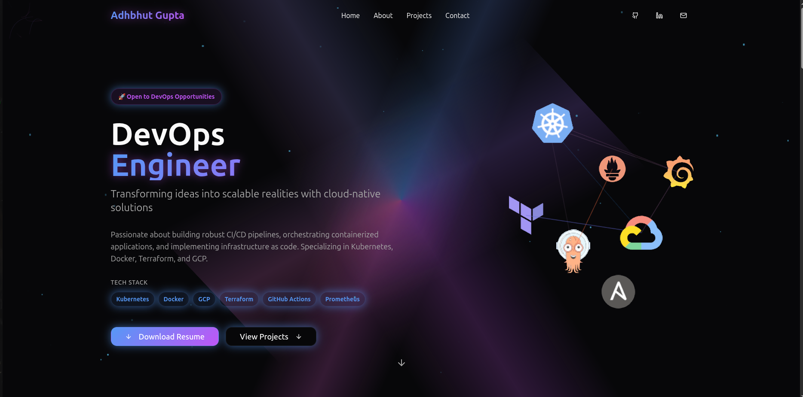
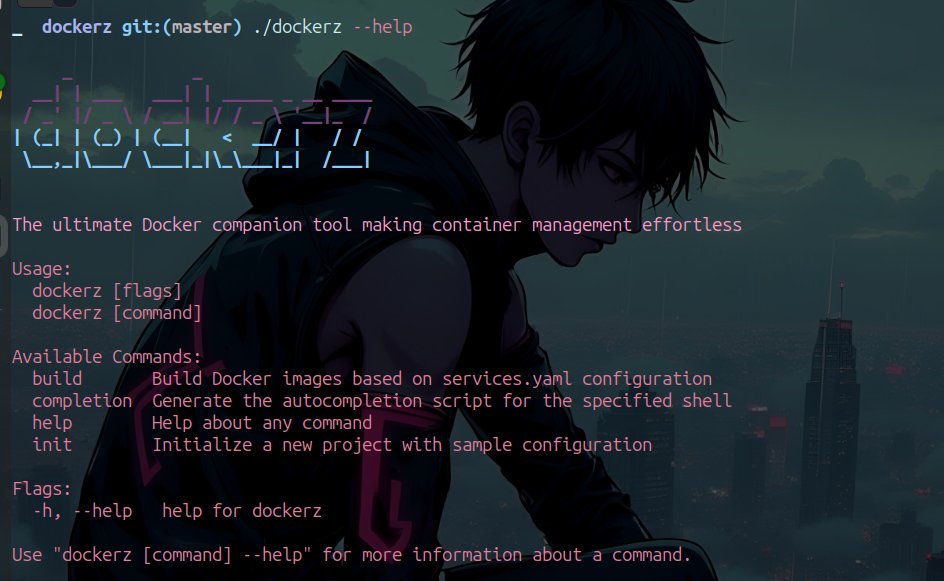
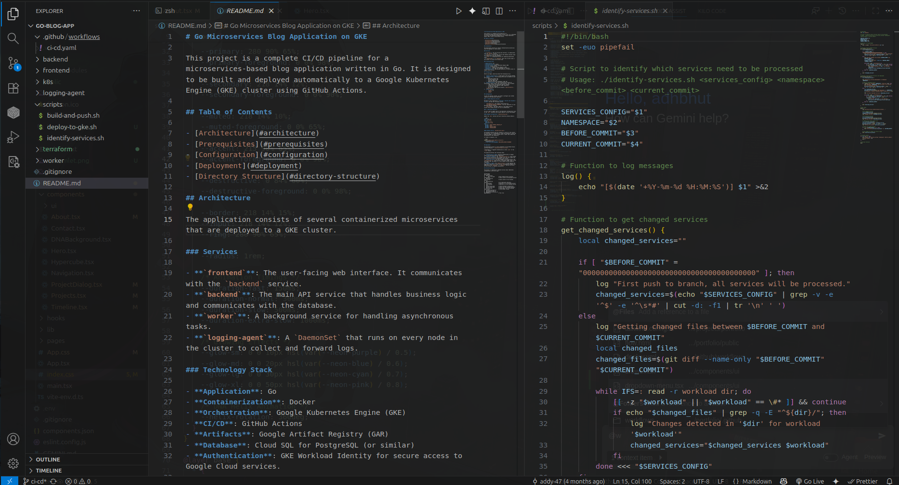
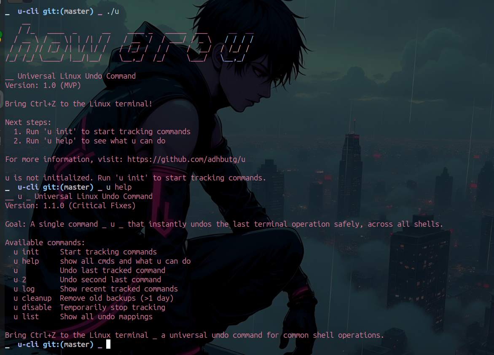
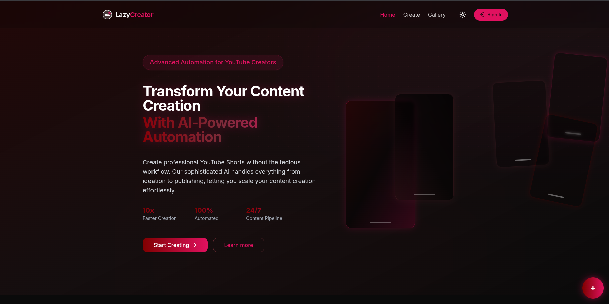
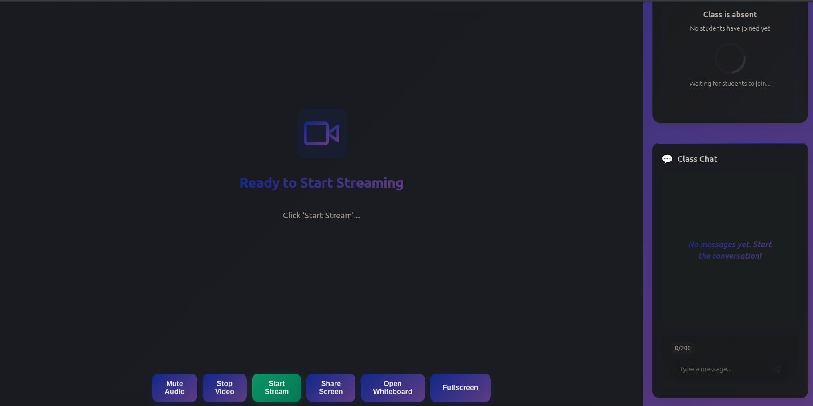
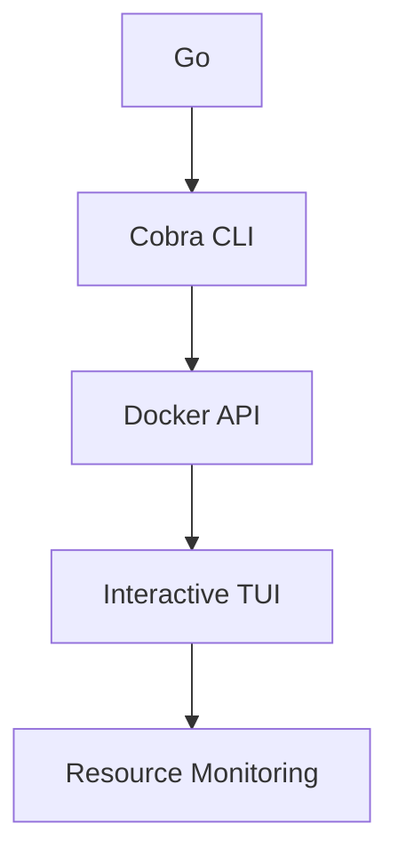
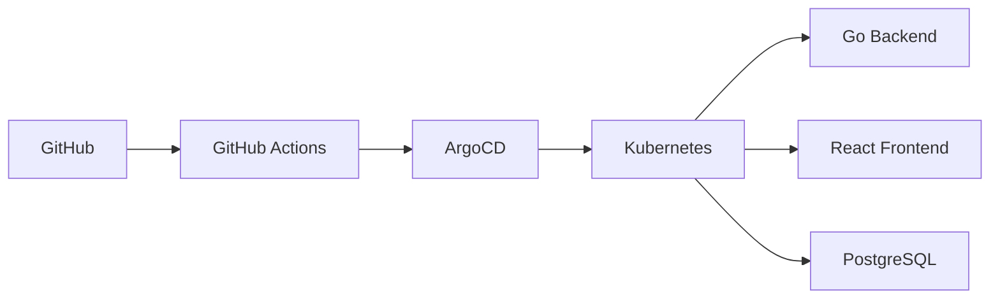

# 👨‍💻 Adhbhut Gupta - DevOps Portfolio



> **DevOps Engineer | Cloud Native Enthusiast | Kubernetes Specialist**  
> **📍 Bangalore, India** | **🌐 [adhbhut.dev](https://adhbhut.dev)**

---

## 🚀 Quick Overview

Welcome to my DevOps portfolio! This modern, interactive website showcases my journey, skills, and projects in the exciting world of DevOps, Cloud Native technologies, and Infrastructure as Code.

### 📊 Portfolio Stats

| Category | Technologies | Level |
|----------|--------------|-------|
| **☁️ Cloud Platforms** | AWS, GCP, Azure | 🌟🌟🌟🌟🌟 |
| **🐳 Containerization** | Docker, Kubernetes, Helm | 🌟🌟🌟🌟🌟 |
| **⚙️ CI/CD** | GitHub Actions, Jenkins, ArgoCD | 🌟🌟🌟🌟🌟 |
| **🏗️ Infrastructure** | Terraform, Pulumi, Ansible | 🌟🌟🌟🌟🌟 |
| **📊 Monitoring** | Prometheus, Grafana, ELK Stack | 🌟🌟🌟🌟 |
| **💻 Programming** | Go, Python, TypeScript, Shell | 🌟🌟🌟🌟 |

---

## 🎯 Featured Projects

### 🐳 [Dockerz](https://github.com/adhbhut/dockerz) - Docker Management Tool


A powerful CLI tool for managing Docker containers, images, and networks with advanced features like resource monitoring and batch operations.

**Tech Stack:** Go, Cobra CLI, Docker API
**Key Features:**
- 📊 Real-time resource monitoring
- 🔄 Batch container operations
- 🎨 Interactive TUI interface
- 📈 Performance analytics

[🔗 View Project](https://github.com/adhbhut/dockerz) | [🚀 Live Demo](https://dockerz.adhbhut.dev)

---

### 🌐 [Go Blog App](https://github.com/adhbhut/go-blog-app) - Full-Stack Blog Platform


A modern blog application built with Go backend and React frontend, deployed on Google Kubernetes Engine with comprehensive CI/CD pipeline.

**Tech Stack:** Go, React, PostgreSQL, Kubernetes, Helm, GitHub Actions
**Architecture:**
- 🏗️ Microservices architecture
- 🔄 GitOps deployment with ArgoCD
- 🛡️ OAuth2 authentication
- 📊 Prometheus monitoring

[🔗 View Project](https://github.com/adhbhut/go-blog-app) | [🚀 Live Demo](https://blog.adhbhut.dev)

---

### 🎯 [U CLI](https://github.com/adhbhut/u-cli) - Universal Development Tool


A comprehensive CLI toolkit designed to streamline development workflows with integrated tools for Git, Docker, Kubernetes, and more.

**Tech Stack:** Go, Cobra CLI, Viper
**Features:**
- 🔄 Git workflow automation
- 🐳 Docker container management
- ☸️ Kubernetes cluster operations
- 📦 Package management integration

[🔗 View Project](https://github.com/adhbhut/u-cli)

---

### 🌳 [LazyCreator](https://github.com/adhbhut/lazycreator) - Project Generator


An intelligent project scaffolding tool that creates complete project structures with best practices, CI/CD pipelines, and documentation.

**Tech Stack:** Go, Templates, CLI
**Capabilities:**
- 🎨 Multi-language project templates
- 🔄 Automated CI/CD setup
- 📚 Documentation generation
- 🔧 Configuration management

[🔗 View Project](https://github.com/adhbhut/lazycreator)

---

### 📊 [Streamlet](https://github.com/adhbhut/streamlet) - Data Processing Pipeline


A real-time data processing and analytics platform built for handling large-scale streaming data with fault tolerance and scalability.

**Tech Stack:** Go, Kafka, Redis, PostgreSQL
**Features:**
- ⚡ Real-time data processing
- 🔄 Stream processing pipelines
- 📈 Analytics and visualization
- 🛡️ Fault-tolerant architecture

[🔗 View Project](https://github.com/adhbhut/streamlet)

---

## 🛠️ Technical Skills

### Cloud & Infrastructure
- **☁️ Cloud Platforms:** AWS, GCP, Azure
- **☸️ Container Orchestration:** Kubernetes, Docker Swarm
- **🏗️ Infrastructure as Code:** Terraform, Pulumi, Ansible
- **🔄 CI/CD:** GitHub Actions, Jenkins, ArgoCD, Tekton
- **📊 Monitoring:** Prometheus, Grafana, ELK Stack, Datadog

### Programming Languages
- **💻 Go** - Primary language for DevOps tools and microservices
- **🐍 Python** - Automation scripts and data processing
- **☕ TypeScript/JavaScript** - Frontend development and tooling
- **🐚 Shell Scripting** - System automation and deployment scripts

### Databases & Storage
- **🗄️ Relational:** PostgreSQL, MySQL
- **📊 NoSQL:** MongoDB, Redis, Elasticsearch
- **☁️ Cloud Storage:** S3, GCS, Azure Blob Storage

---

## 🎨 Portfolio Website Features

This portfolio website itself is a showcase of modern web development practices:

### 🚀 Built With
- **⚡ Vite** - Lightning-fast build tool
- **⚛️ React** - Modern UI framework
- **🔷 TypeScript** - Type-safe development
- **🎨 Tailwind CSS** - Utility-first styling
- **🧩 shadcn/ui** - Beautiful component library

### 🌟 Key Features
- **📱 Responsive Design** - Works perfectly on all devices
- **🎨 Interactive UI** - Smooth animations and transitions
- **⚡ Performance Optimized** - Fast loading and smooth interactions
- **♿ Accessibility** - WCAG compliant design
- **🔍 SEO Friendly** - Optimized for search engines

### 🎯 Technologies Used
```typescript
// Frontend Stack
const techStack = {
  framework: 'React 18',
  buildTool: 'Vite',
  language: 'TypeScript',
  styling: 'Tailwind CSS',
  uiLibrary: 'shadcn/ui',
  stateManagement: 'React Context',
  routing: 'React Router',
  animations: 'Framer Motion'
};
```

---

## 📈 Project Architecture

### 🏗️ Tech Tree Visualization

Each project follows modern DevOps practices with comprehensive tech stacks:

#### Dockerz Tech Stack


#### Go Blog App Architecture


---

## 🎓 Education & Certifications

- **🎓 B.Tech in Computer Science** - [University Name]
- **☁️ AWS Certified Solutions Architect** - Associate
- **☸️ Certified Kubernetes Administrator (CKA)**
- **🔒 HashiCorp Certified: Terraform Associate**

---

## 📞 Get In Touch

I'm always open to discussing new projects, creative ideas, or opportunities to be part of your vision.

### 📧 Contact Information
- **📧 Email:** [adhbhut.gupta@example.com](mailto:adhbhut.gupta@example.com)
- **🌐 Website:** [adhbhut.dev](https://adhbhut.dev)
- **💼 LinkedIn:** [linkedin.com/in/adhbhutgupta](https://linkedin.com/in/adhbhutgupta)
- **🐙 GitHub:** [github.com/adhbhut](https://github.com/adhbhut)
- **🐦 Twitter:** [@adhbhut_dev](https://twitter.com/adhbhut_dev)

### 📍 Location
**Bangalore, India** 🇮🇳

---

## 🤝 Contributing

Contributions are welcome! Please feel free to submit a Pull Request.

1. Fork the repository
2. Create your feature branch (`git checkout -b feature/amazing-feature`)
3. Commit your changes (`git commit -m 'Add some amazing feature'`)
4. Push to the branch (`git push origin feature/amazing-feature`)
5. Open a Pull Request

---

## 📄 License

This project is licensed under the MIT License - see the [LICENSE](LICENSE) file for details.

---

## 🙏 Acknowledgments

- **🎯 Inspiration:** The DevOps community and open-source contributors
- **🛠️ Tools:** All the amazing tools and frameworks that make modern development possible
- **👥 Mentors:** Those who have guided and supported my journey

---

> **"The best way to predict the future is to create it."** - Peter Drucker

Let's build something amazing together! 🚀✨
